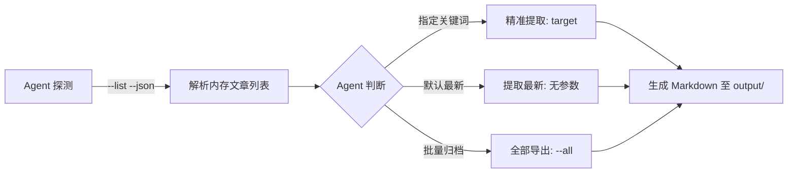

# WeChat Article Extract.skill (wechat_article_extract)

<p align="center">
  
  
  
  
  
</p>

本项目是一个基于**操作系统进程内存分析与 Chromium 渲染树解析**的微信公众号文章提取 Agent Skill。

通过探索 Windows 虚拟内存页面遍历（Win32 Memory Scanning）与 Blink 渲染引擎内存 DOM 结构化提取机制，实现将本地客户端正在渲染的文档内容无损解析为规范的 Markdown 格式，便于个人本地离线阅读、文献整理与学术研究。

---

## 🔬 技术研究与探索方向

本项目主要围绕以下系统底层与编译/渲染原理展开技术探索：

1. **Win32 进程虚拟内存管理**：
   * 探索 `VirtualQueryEx` 遍历 `MEM_COMMIT` 提交状态内存页的技术原理。
   * 研究 Windows 平台下跨进程内存安全读取（`ReadProcessMemory`）的权限与边界。
2. **Chromium / Blink 渲染架构内存机制**：
   * 分析多进程架构下 Renderer 进程中的 UTF-16 内存 DOM 驻留周期。
   * 探索客户端预加载模板（Template Cache）与活动页面渲染树的特征识别算法。
3. **HTML AST 结构化序列化**：
   * 基于 `lxml` 实现对渲染 DOM 节点的深度优先遍历、样式清洗与 Markdown 规范重构。
4. **AI Agent 标准作业接口（AgentSkills.io）**：
   * 探索将本地系统级底层工具封装为符合开放协议的 Agent Skill，提供标准化结构化探测（JSON）与自主决策执行能力。

---

## 🌟 方案对比（技术实现维度）

| 传统网络代理/网络抓包方案 | 本项目（内存 DOM 分析方案） |
|---|---|
| 依赖网络通信拦截、CA 证书劫持与本地代理配置 | 纯本地进程虚拟内存分析，**不发起网络请求，不劫持流量** |
| 容易受服务端鉴权、网络抖动及证书配置影响 | 直接面向客户端已呈现的最终渲染状态，保真度高 |
| 涉及网络层协议伪造与数据交互 | 专注于操作系统层与渲染引擎内存数据的读取研究 |

---

## ✨ 核心特性

- 📄 **结构化文档生成**：自动识别标题层级（H1~H4）、正文段落、表格与代码块（`pre/code`）。
- 🖼️ **富媒体资源链接提取**：保留文章内嵌高清图片及动图的原始引用地址。
- 📁 **独立输出隔离**：提取结果默认自动统一存放在独立的 `./output/` 文件夹中，避免污染工作区。
- 🌍 **多语言与混排支持**：原生支持中文、英文技术术语及代码段的混合解析。
- 🤖 **遵循 Agent Skills 开放规范**：根目录内置符合 [AgentSkills.io](https://agentskills.io/) 标准的 `SKILL.md`，支持被通用 AI Agent 无缝加载调用。

---

## 🚀 快速使用

### 1. 环境准备

确保已安装 Python 3.8+ 及依赖库：

```bash
git clone https://github.com/MARCIALCAO/wechat_article_extract.git
cd wechat_article_extract
pip install -r requirements.txt
```

### 2. 本地运行

在电脑微信中打开需要整理归档的文章页面，然后在终端执行：

#### 提取最新打开的文章（默认保存至 `./output/`）
```bash
python scripts/wechat_article_extract.py
```

#### 探测当前内存中已打开的文章列表
```bash
python scripts/wechat_article_extract.py --list
```

#### 按标题关键词精准过滤提取
```bash
python scripts/wechat_article_extract.py "关键词"
```

#### 批量导出当前打开的所有文章
```bash
python scripts/wechat_article_extract.py --all
```

---

## 🛠️ CLI 参数速查

```text
用法: wechat_article_extract.py [-h] [--list] [--all] [--json] [--output-dir OUTPUT_DIR] [target]

参数:
  target                目标文章URL、标题、公众号或正文关键词（可选）
  --list                列出当前内存中已渲染打开的有效文章列表
  --all                 批量解析并保存内存中打开的所有文章
  --json                以 JSON 格式输出扫描结果（面向 AI Agent 结构化调用）
  --output-dir OUTPUT_DIR
                        输出 Markdown 文件目录（默认 ./output/ 文件夹）
```

---

## 🤖 作为 AI Agent Skill 使用

本项目根目录提供了标准的 [SKILL.md](SKILL.md)，任何支持 Skill 规范的 AI Coding Agent 均可直接加载调用。

### Agent 标准调用流程（SOP）：



---

## 📂 项目结构

```text
wechat_article_extract/
├── scripts/
│   └── wechat_article_extract.py # 核心内存分析与 Markdown 解析脚本
├── SKILL.md                      # 遵循 AgentSkills.io 规范的 Agent SOP
├── requirements.txt              # 项目依赖 (lxml)
├── README.md                     # 项目说明文档
├── LICENSE                       # MIT 许可证
└── .gitignore
```

---

## ⚠️ 学术研究与免责声明

* **技术研究性质**：本项目仅用于探索 Windows 虚拟内存分析及Chromium 渲染引擎内部数据结构的教学与技术研究目的。
* **合法合规使用**：请使用者严格遵守相关法律法规，仅将本工具用于个人拥有合法访问权限的文章、个人笔记离线整理与学术备份场景。
* **版权保护**：请尊重所有文章原创作者与出版方的知识产权，严禁将提取内容用于任何商业化目的或侵犯他人合法权益的行为。

---

## 📄 License

本项目采用 [MIT License](LICENSE) 授权开源。
