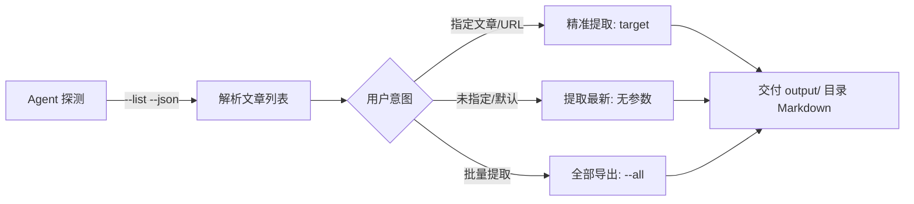

# WeChat Article Extract (wechat_article_extract)

<p align="center">
  
  
  
  
</p>

微信公众号文章（含**付费文章**、**禁止复制文章**、**中英文技术长文**）全文提取工具与 AI Agent Skill。

通过**客户端渲染层内存 DOM 直提（In-Memory DOM Extraction）**技术，实现**零配置、免抓包、免证书代理、秒级无损**导出为排版清晰的 Markdown 文件，默认自动输出到独立的 `./output/` 文件夹。

---

## 🌟 核心优势

| 传统抓包 / 爬虫方案 | 本工具（内存直提方案） |
|---|---|
| ❌ 需安装 CA 根证书、配置本地代理（易断网） | ✅ **零配置**：无需安装任何证书，不改动网络设置 |
| ❌ 频繁遭遇 Cookie 过期、Token 失效与验证码 | ✅ **免鉴权**：直接从客户端渲染内存读取，免疫反爬 |
| ❌ 易受公众号前端“禁止复制/文字防选”拦截 | ✅ **物理级穿透**：直接读取底层 DOM 树，绕过一切前端限制 |
| ❌ 账号存在风控、设备绑定异常风险 | ✅ **100% 安全**：只读本地内存，无网络逆向，零封号风险 |
| ❌ 付费文章需繁琐提取鉴权 Key | ✅ **只要在电脑微信中能看，就能 100% 完整提取** |

---

## ✨ 主要特性

- ⚡ **秒级无损提取**：自动解析层级标题（H1~H4）、正文段落、代码块（`pre/code`）。
- 📁 **独立输出隔离**：提取结果默认自动统一存放在 `./output/` 独立目录，保持项目根目录整洁。
- 🖼️ **高清媒体保留**：自动提取微信高清图片原图直链（`mmbiz.qpic.cn`）与动图。
- 🏷️ **真实元数据回溯**：精准捕获主标题、公众号名称、作者及原文链接，自动清洗底部广告与微信 UI 噪点。
- 🌍 **全语言支持**：原生支持中文、英文、符号及代码混排。
- 🔄 **多标签页智能消歧**：按打开时间倒序排列，支持按标题、URL、公众号关键词精准过滤，或一键批量导出所有打开的文章。
- 🤖 **AI Agent 深度适配**：内置标准 `SKILL.md`，提供 `--list --json` 结构化探测接口，便于与 AutoGen、Claude Code、Cursor、Gemini CLI 等各类 AI Agent 无缝集成。

---

## 🚀 快速上手

### 1. 环境准备

确保已安装 Python 3.8+ 及依赖库：

```bash
git clone https://github.com/your-username/wechat_article_extract.git
cd wechat_article_extract
pip install -r requirements.txt
```

### 2. 基本使用

在电脑微信中**打开目标文章**（付费文章需已购买并进入阅读界面），然后在终端运行：

#### 提取最新打开的文章（默认保存至 `./output/` 文件夹）
```bash
python scripts/wechat_article_extract.py
```

#### 探测当前打开的所有文章
```bash
python scripts/wechat_article_extract.py --list
```

#### 按标题、URL 或关键词精准提取
```bash
python scripts/wechat_article_extract.py "口外篇"
# 或直接传入文章链接
python scripts/wechat_article_extract.py "https://mp.weixin.qq.com/s/xxxx"
```

#### 一键批量提取所有已打开的文章
```bash
python scripts/wechat_article_extract.py --all
```

---

## 🛠️ CLI 参数速查

```text
用法: wechat_article_extract.py [-h] [--list] [--all] [--json] [--output-dir OUTPUT_DIR] [target]

参数:
  target                目标文章 URL、标题、公众号或正文关键词（可选）
  --list                列出当前微信客户端内存中所有打开的文章
  --all                 批量提取并保存内存中打开的所有文章
  --json                以 JSON 格式输出扫描结果（面向 AI Agent 结构化调用）
  --output-dir OUTPUT_DIR
                        输出 Markdown 文件目录（默认 ./output/ 文件夹）
```

---

## 🤖 作为 AI Agent Skill 使用

本项目根目录提供了标准的 [SKILL.md](SKILL.md)，任何支持 Skill 规范的 AI Coding Agent 均可直接加载调用。

### Agent 标准调用流程（SOP）：



1. **探测阶段**：Agent 调用 `python scripts/wechat_article_extract.py --list --json` 获取结构化上下文。
2. **执行阶段**：根据用户指令执行提取或消歧，文件默认写入 `./output/`。
3. **交付阶段**：直接读取生成的 Markdown 交付用户。

---

## 📖 技术原理

1. **Chromium 渲染层必然性**：
   微信内置的浏览器内核（`WeChatAppEx.exe`，Radium 框架）在页面呈现时，必须在内存页（`MEM_COMMIT`）中维护解密后的 UTF-16 DOM 树。
2. **Win32 内存扫描与边界扩展**：
   工具调用 Windows 底层 API（`VirtualQueryEx`、`ReadProcessMemory`）扫描提交内存，以 `#js_content`、`#activity-name` 为锚点向前扩展切片，完整捕获 DOM 节点并由 `lxml` 完成 AST 解析与 Markdown 序列化。
3. **模板过滤与生命周期排序**：
   自动识别并剔除 Chromium 预加载的空模板（`content_noencode.DATA`），结合进程创建时间戳实现时间倒序排布。

---

## 📂 项目结构

```text
wechat_article_extract/
├── scripts/
│   └── wechat_article_extract.py # 核心内存提取与解析脚本
├── SKILL.md                      # AI Agent Skill 规范文件
├── requirements.txt              # 项目依赖
├── README.md                     # 项目说明文档
├── LICENSE                       # MIT 许可证
└── .gitignore
```

---

## ⚠️ 免责声明

* 本工具仅供个人学习、离线阅读备份及技术研究使用。
* 请尊重原创作者的知识产权与版权，切勿将提取内容用于商业用途或未经授权的二次分发。

---

## 📄 License

本项目采用 [MIT License](LICENSE) 授权开源。
